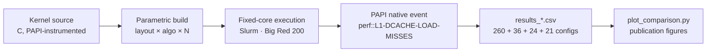

<div align="center">

# finance-cache-hpc

**Empirical L1 cache behaviour of four quantitative finance kernels on AMD EPYC**

<sub>Cholesky · Monte Carlo paths · GARCH(1,1) MLE · dense GEMM - instrumented with PAPI hardware counters on Indiana University's Big Red 200.</sub>

<br/>


</div>

---

## TL;DR

Most papers that talk about "cache-friendly finance code" argue from the algorithm. This repo argues from the **counter**. Four production-representative kernels, a parametric build sweep across layouts and algorithms, PAPI counters pinned to a fixed core, and three findings that run counter to textbook intuition.

| # | Finding | So what |
|---|--------|---------|
| **1** | **Cholesky: layout dominates algorithm.** Row-major vs column-major → **28× variation** in L1 misses. Banachiewicz vs Crout → <3%. | If you're profiling Cholesky and only swapping algorithms, you're optimising the wrong axis. |
| **2** | **Monte Carlo: sharp L1 phase transition.** A **1,657× jump** in L1 misses between portfolio dim `d=50` and `d=100` - coincides with the triangular factor crossing the 32 KB L1d boundary. | Portfolio sizing decisions hide a hardware cliff. Pricing d=100 isn't 2× harder than d=50; it's two orders of magnitude harder. |
| **3** | **GARCH: compute-bound despite cache misses.** A **500× L1 miss rate increase** costs only **3%** throughput. | The GARCH recurrence is serialised by loop-carried dependency. The cache is innocent - the dependency chain is the bottleneck. |

---

## Why this exists

Quant workflows get rewritten for speed constantly, but most "optimisation" is guesswork against an abstracted cost model. The hardware tells a different story. This repo is a small, reproducible argument for **measuring before tuning** - and for treating the L1 data cache as a first-class citizen in numerical finance.

---

## Methodology



Each kernel is compiled into multiple binaries (one per configuration of storage layout, algorithm variant, and problem size). Every run is pinned to a single EPYC core, counters are read at kernel boundaries, and results land in CSV for analysis.

---

## Quick start

```bash
# On a system with PAPI installed
module load papi          # if using environment modules
cd src
make finance              # builds cholesky, mc_paths, garch, gemm variants

# Run a single benchmark
./bin/cholesky_ROW_MAJOR_ALGO_BANACHIEWICZ 1000
./bin/mc_paths_ROW_MAJOR 100 100000
./bin/garch_mle 10000 1000

# Full sweep (Slurm)
cd ../scripts
sbatch run_finance_kernels.sh

# Generate figures
python3 plot_comparison.py
```

**Prerequisites** - Linux · GCC 7.5+ · [PAPI](https://icl.utk.edu/papi/) 7.2+ · Python 3 with `matplotlib`, `pandas` · Slurm (optional, for the full sweep).

---

## Layout

```
.
├── src/
│   ├── Makefile              # Parametric build (layouts × algorithms)
│   ├── cholesky_papi.c       # Cholesky factorisation
│   ├── mc_paths_papi.c       # Correlated MC path generation
│   ├── garch_mle_papi.c      # GARCH(1,1) MLE via grid search
│   └── mm_papi.c             # Dense GEMM (validation benchmark)
├── scripts/
│   ├── run_finance_kernels.sh  # Slurm batch driver
│   └── plot_comparison.py      # Publication figure generator
└── data/
    ├── results.csv             # GEMM            (260 configs)
    ├── results_cholesky.csv    # Cholesky        (36)
    ├── results_mcpaths.csv     # MC paths        (24)
    └── results_garch.csv       # GARCH           (21)
```

---

## Platform

| | |
|---|---|
| **CPU**       | AMD EPYC 7742, 2.25 GHz (Zen 2) |
| **L1d**       | 32 KB per core · 8-way · 64 B lines |
| **L2**        | 512 KB per core |
| **L3**        | 256 MB shared |
| **PAPI**      | 7.2.0.1 · native event `perf::L1-DCACHE-LOAD-MISSES` |
| **System**    | Indiana University Big Red 200 |

---

## Roadmap

- [ ] Extend to L2 / L3 miss counters and bandwidth-bound regimes
- [ ] Add roofline positioning per kernel configuration
- [ ] Repeat the sweep on Intel Sapphire Rapids and compare microarchitectures
- [ ] Publish the companion note / short paper

---

## Cite

```bibtex
@misc{bathuri2026cache,
  author       = {Pradyot Bathuri},
  title        = {Cache-Aware Computation for Quantitative Finance Workloads on {AMD} {EPYC}},
  year         = {2026},
  institution  = {Indiana University Bloomington},
  howpublished = {\url{https://github.com/pbathuri/finance-cache-hpc}}
}
```

---

<div align="center">
<sub>Part of a broader research line on HPC + quantitative finance.<br/>
See also <a href="https://github.com/pbathuri/Research_HPC_QFinance_Cache">Research_HPC_QFinance_Cache</a> · <a href="https://github.com/pbathuri">@pbathuri</a></sub>
</div>
